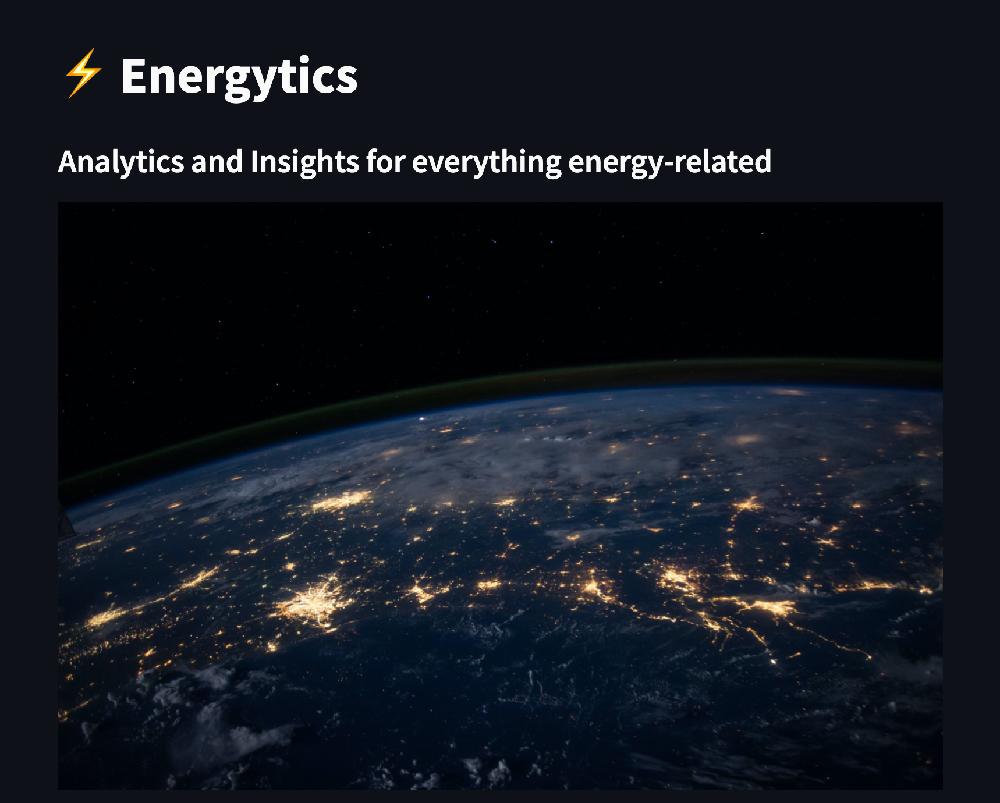
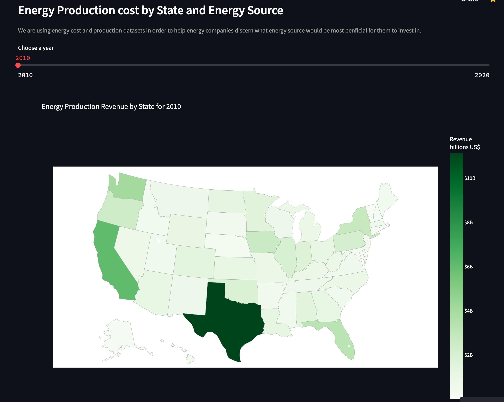
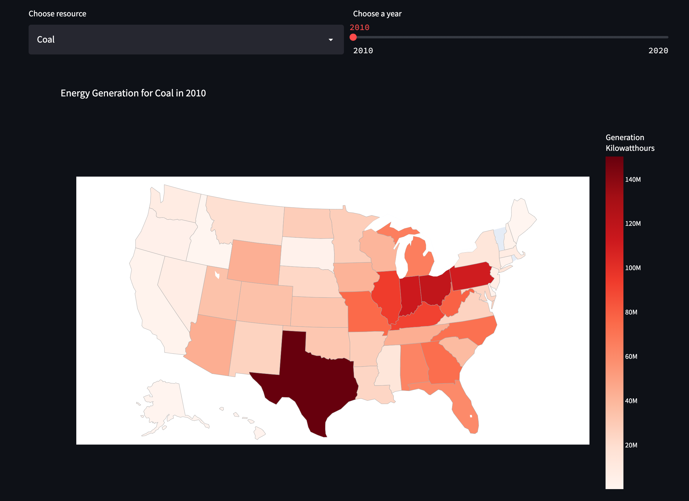
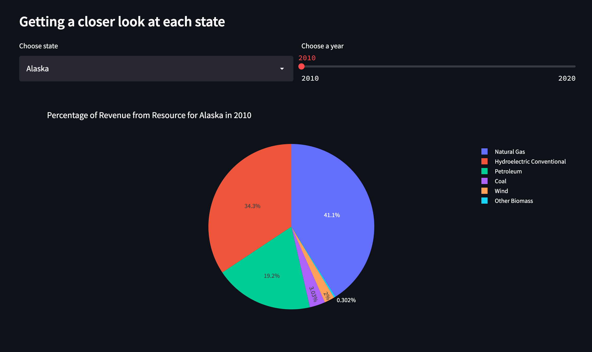
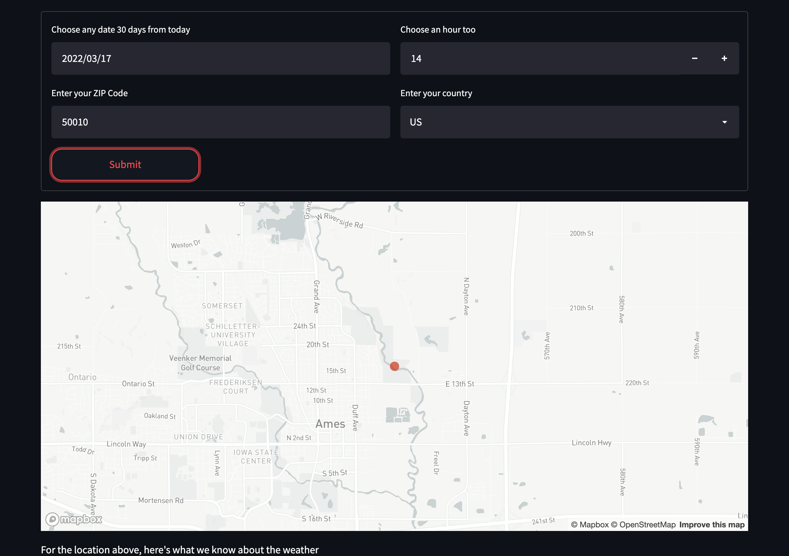
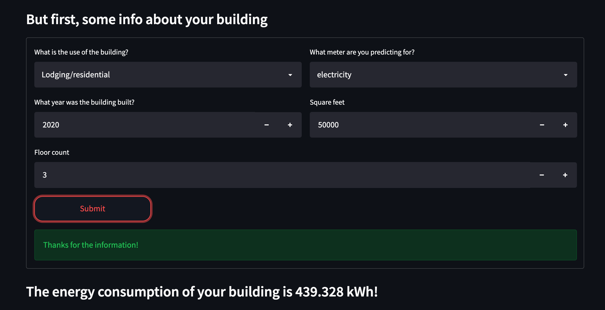

# Energytics 💡⚡ (HackIllinois 2022)

## About

An app that visualizes and predicts energy generation and consumption for companies and consumers.

[Devpost Submission](https://devpost.com/software/energytics)

## Tech stack

- Streamlit (front-end)
- Pandas, Sklearn, LightGBM (ML)
- Plotly, Seaborn, matplotlib (data viz)
- Open Weather Map (Weather API)

### Datasets used

1. [Eletricity data - U.S. Energy Information Administration](https://www.eia.gov/electricity/data/state/)
2. [Power Generation Costs - International Renewable Energy Agency (IRENA)](https://www.irena.org/costs/Power-Generation-Costs)
3. [ASHRAE - Great Energy Predictor III](https://www.kaggle.com/c/ashrae-energy-prediction/overview)

## Challenges we faced

- Finding relevant data for performing our analysis was the first obstacle we faced. While we were able to readily find data about renewable energy in European countries, the same was not the case for the United States. Finding relevant data was very difficult and took ~4 hours of researching to get the data as well as to clean it.
- Model Training and Hyperparameter tuning presented themselves as a challenge in a short timeline. The dataset we compiled consisted of more than 600 thousand rows hence to be able to produce a good model, the tuning model had to go through many layers and many repetitions to finally produce the best parameters.
- Building an application on streamlit was a brand new process for most of us. Hence, we learned from each other and also learn from articles online on how to develop on that platform.

## Team members

- [@Andrew Schaefer](https://www.linkedin.com/in/schaefer-andrew/)
- [@Benedict Neo](https://www.linkedin.com/in/benedictn)
- [@Diwaker Sinha](https://www.linkedin.com/in/diwaker-sinha-072aa118b/)
- [@Geitanksha Tandon](https://www.linkedin.com/in/geitanksha/)
- [@Soham Kulkarni](https://www.linkedin.com/in/soham-kulkarni-503764227/)
- [@Tan Wei Chun](https://www.linkedin.com/in/wei-chun/)

## Future Goals

- We can track the trend of renewable sources of energy as well as the trend of fossil fuels using our machine learning model
- Find more specific data on energy for specific companies and in general more data is definitely needed for further development of this project
